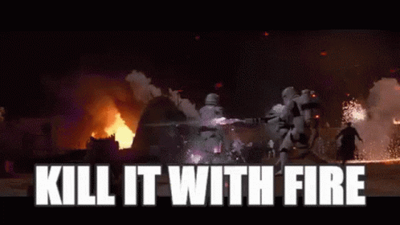

```
⠀⠀⠀⠀⠀⠀⢱⣆⠀⠀⠀⠀⠀⠀
⠀⠀⠀⠀⠀⠀⠈⣿⣷⡀⠀⠀⠀⠀
⠀⠀⠀⠀⠀⠀⢸⣿⣿⣷⣧⠀⠀⠀
⠀⠀⠀⠀⡀⢠⣿⡟⣿⣿⣿⡇⠀⠀
⠀⠀⠀⠀⣳⣼⣿⡏⢸⣿⣿⣿⢀⠀
⠀⠀⠀⣰⣿⣿⡿⠁⢸⣿⣿⡟⣼⡆
⢰⢀⣾⣿⣿⠟⠀⠀⣾⢿⣿⣿⣿⣿
⢸⣿⣿⣿⡏⠀⠀⠀⠃⠸⣿⣿⣿⡿
⢳⣿⣿⣿⠀⠀⠀⠀⠀⠀⢹⣿⡿⡁
⠀⠹⣿⣿⡄⠀⠀⠀⠀⠀⢠⣿⡞⠁
⠀⠀⠈⠛⢿⣄⠀⠀⠀⣠⠞⠋⠀⠀
⠀⠀⠀⠀⠀⠀⠉⠀⠀⠀⠀⠀⠀⠀
```

Welcome to our (Ziang Liu @AceSix, Peter Li @petersli & Anderson Addo @andersonaddo)
wildfire simulation!

It is a C++ Qt Creator project based on these papers:
- [Fire in Paradise: Mesoscale Simulation of Wildfires](http://computationalsciences.org/publications/haedrich-2021-wildfires.html)
- [Stormscapes: Simulating Cloud Dynamics in the Now](http://computationalsciences.org/publications/haedrich-2020-stormscapes.html)

In case those links are dead you can see those papers in the README_papers folder.

Here's a shot of what it can do:


This simulation handles heat spread through the air and through individual trees, convection,
water evaporation and condensation and clouds, wind, combustion, and trees can eventually burn to 
nothingness. The UI also has some useful visualization tools to view temperature fields, vector fields,
and other properties of both trees and the air.

Most of the calculations in the project are aimed to by true to the papers and physically accurate. However, to improve stability and get the type of behaviour we were looking for, we did tweak some things.
Most of these tweaked variables are either separated in `physics.h` or are spread around in `wind.cu`. We also capped some values for stability, and added some magic numbers to our renderings of clouds, fire and smoke to make them look good. 

This codebase makes use of CUDA, and uses preprocessors (using a `CUDA_FLUID` flag) to change how the codebase is compiled depending on whether CUDA is installed or not. Our `cuda_lib.pri` 
assumes that Windows and Linux will run the code with CUDA, edit it if that's not the case.

Without CUDA, the simulation will still look cool, but there will be no complicated wind physics and
convection, and there will also be no clouds. 

By the way, on the Forest scene, you can hold Ctrl (or Command) or Shift and click to 
raycast to the floor and change the temperatures of the trees around where that 
ray hits the ground. Thanks to [this](http://www.rw-designer.com/cursor-set/charmander-1)
 guy and [that](http://www.rw-designer.com/cursor-detail/22266) guy for the nice mouse cursors we used
in this feature.



